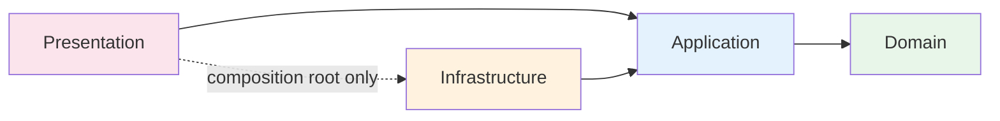
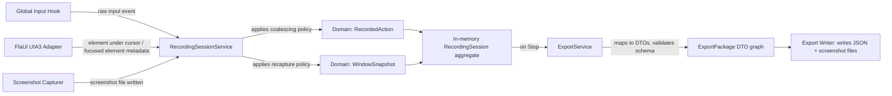
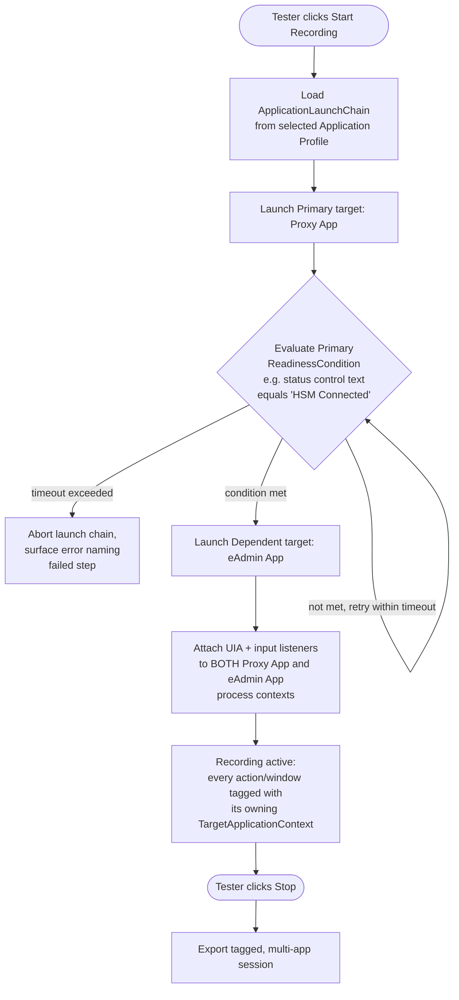
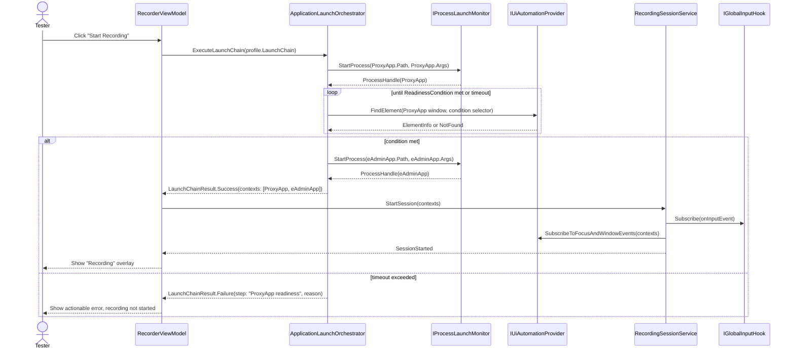
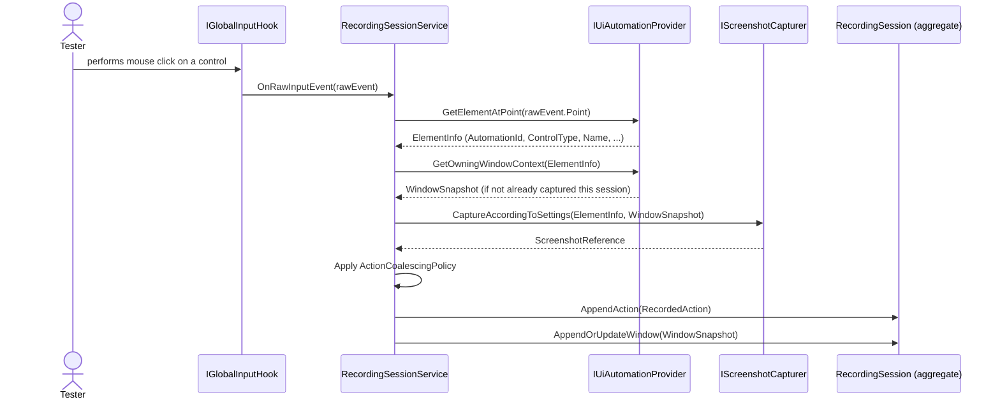
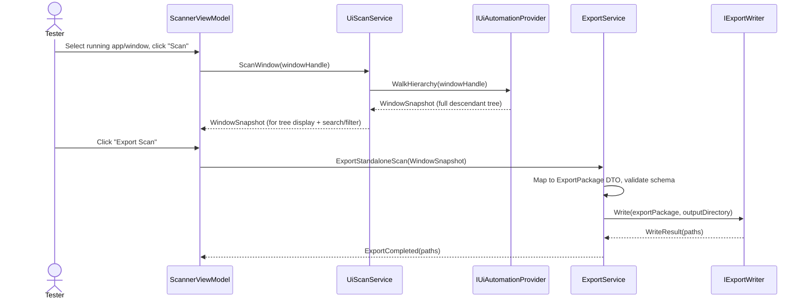
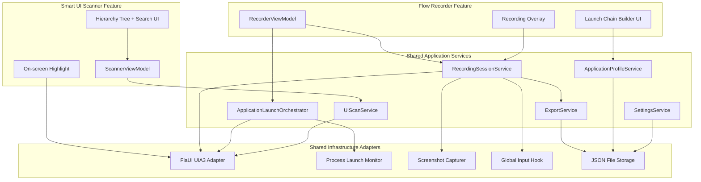

# Architecture Document
## Windows UI Flow Recorder & Smart UI Scanner

**Document status:** This is the master technical reference. `SystemDesign.md`, `DataModel.md`, `UseCases.md`, `TestingStrategy.md`, `Roadmap.md`, `RiskAnalysis.md`, `FutureEnhancements.md`, and `CodingGuidelines.md` must all be consistent with the boundaries, layers, and diagrams defined here. This document does not contain source code — it defines structure, responsibilities, and contracts only, at a level of detail sufficient for an implementing engineer or coding agent to build against without further architectural decisions.

---

## 1. Architectural Goals & Principles

1. **Strict layering (Clean Architecture)** — the capture engine (Domain/Application) must have zero dependency on WPF, FlaUI's concrete UIA3 provider, or the filesystem. This is what allows FutureEnhancements (e.g., AI-assisted generation, a CLI front-end, or a different UI shell) to be added without touching capture logic.
2. **Offline-by-construction** — no project in the solution may reference networking namespaces/packages except where explicitly and narrowly required (there is no such requirement in MVP, so in practice no project should reference networking at all). This is enforced architecturally (see §9) and verified by an automated test (see TestingStrategy.md).
3. **Automation-provider abstraction** — all FlaUI/UIA3 access is isolated behind interfaces owned by the Application layer, implemented in Infrastructure. No FlaUI type appears in a ViewModel, in the Domain layer, or in an exported DTO.
4. **Multi-application awareness as a core concept, not an add-on** — the domain model treats a Recording Session as owning one or more "Target Application Contexts" (a launch-chain concept), each independently trackable, from the very first phase. The Proxy App → eAdmin App scenario is a specific configuration of this generic concept, not special-cased code.
5. **DTO/export stability** — the JSON export contract (`ExportPackage` and everything it contains) is treated as a versioned public contract between this tool and any future consumer (hand-written Page Objects today, AI-assisted generation later). Internal domain models may evolve independently of the export DTOs; a mapping layer keeps them decoupled.
6. **Testability first** — every UIA-touching component sits behind an interface with a corresponding fake/mock usable in unit tests without a real Windows UI Automation tree, per TestingStrategy.md.

---

## 2. High-Level Architecture

```mermaid
graph TB
    subgraph Presentation["Presentation Layer (WPF / MVVM)"]
        UIRecorder["Flow Recorder Views + ViewModels"]
        UIScanner["Smart UI Scanner Views + ViewModels"]
        UISettings["Settings / Profiles Views + ViewModels"]
        Overlay["Recording Status Overlay"]
    end

    subgraph Application["Application Layer"]
        RecSvc["Recording Session Service"]
        ScanSvc["UI Scan Service"]
        LaunchSvc["Application Launch Orchestrator"]
        ExportSvc["Export Service"]
        ProfileSvc["Application Profile Service"]
        SettingsSvc["Settings Service"]
    end

    subgraph Domain["Domain Layer"]
        Entities["Core Entities: RecordingSession, TargetApplicationContext,
RecordedAction, WindowSnapshot, ElementInfo, ReadinessCondition"]
        DomainRules["Domain Rules: coalescing policy, hierarchy re-capture policy,
readiness evaluation contracts"]
    end

    subgraph Infrastructure["Infrastructure Layer"]
        UiaProvider["FlaUI UIA3 Adapter"]
        ProcessMgr["Process Launch & Monitor Adapter"]
        ScreenCap["Screenshot Capture Adapter"]
        FileStore["Local File/JSON Storage Adapter"]
        InputHook["Global Input Hook Adapter (mouse/keyboard)"]
        LoggingImpl["Logging Provider (Microsoft.Extensions.Logging sinks)"]
    end

    UIRecorder --> RecSvc
    UIRecorder --> LaunchSvc
    UIScanner --> ScanSvc
    UISettings --> SettingsSvc
    UISettings --> ProfileSvc
    Overlay --> RecSvc

    RecSvc --> Entities
    RecSvc --> DomainRules
    RecSvc --> ExportSvc
    ScanSvc --> Entities
    LaunchSvc --> Entities
    LaunchSvc --> DomainRules

    RecSvc -.depends on interface.-> UiaProvider
    RecSvc -.depends on interface.-> InputHook
    RecSvc -.depends on interface.-> ScreenCap
    ScanSvc -.depends on interface.-> UiaProvider
    LaunchSvc -.depends on interface.-> ProcessMgr
    LaunchSvc -.depends on interface.-> UiaProvider
    ExportSvc -.depends on interface.-> FileStore
    ProfileSvc -.depends on interface.-> FileStore
    SettingsSvc -.depends on interface.-> FileStore

    Application -. logs via .-> LoggingImpl
    Infrastructure -. logs via .-> LoggingImpl
```



**Reading this diagram:** solid arrows are normal calls flowing inward (Presentation → Application → Domain). Dashed arrows are Application-layer components depending on *interfaces* they own, which Infrastructure implements — this is the Dependency Inversion that keeps Domain/Application ignorant of FlaUI, WPF, and the filesystem.

---

## 3. Clean Architecture Layers

### 3.1 Domain Layer (innermost — no external dependencies)
Owns the core business entities and pure domain rules. Contains no reference to FlaUI, WPF, System.IO for persistence, or any Microsoft.Extensions.* package other than abstractions it may choose to depend on minimally (even this should be avoided where possible; prefer plain interfaces).

Responsibilities:
- Define entities: `RecordingSession`, `TargetApplicationContext`, `RecordedAction`, `WindowSnapshot`, `ElementInfo`, `ApplicationLaunchChain`, `ReadinessCondition`, `ScreenshotReference`.
- Define domain rules as pure functions/policies: action-coalescing policy, hierarchy re-capture-sensitivity policy, readiness-condition evaluation *contract* (the interface only — evaluation against real UIA is Infrastructure's job).
- Define repository/gateway **interfaces** used by Application (e.g., `ISessionRepository`, `IApplicationProfileRepository`) — Domain defines the contract, Infrastructure implements it.

### 3.2 Application Layer
Orchestrates use cases by composing Domain entities and calling interfaces implemented by Infrastructure. Contains no UI framework types and no concrete automation/file-system code.

Responsibilities:
- `RecordingSessionService` — start/pause/resume/stop a session; owns the in-memory `RecordingSession` aggregate while recording; applies coalescing/re-capture policies from Domain as events arrive from Infrastructure adapters.
- `ApplicationLaunchOrchestrator` — executes an `ApplicationLaunchChain`: launches the Primary target, evaluates its `ReadinessCondition` via the UIA adapter interface, then launches each Dependent target in order, repeating readiness evaluation per step; raises a structured failure if any step times out.
- `UiScanService` — performs an on-demand hierarchy scan of a selected window/application, independent of a recording session; used by both the Smart UI Scanner feature and internally by the Recorder when it needs an initial hierarchy snapshot.
- `ExportService` — maps the internal `RecordingSession` (or a standalone scan result) into the versioned `ExportPackage` DTO graph, validates it against the current schema version, and hands it to the storage interface to be written.
- `ApplicationProfileService` — CRUD for saved `ApplicationProfile`/`ApplicationLaunchChain` configurations.
- `SettingsService` — CRUD for user settings (screenshot mode, sensitivity, timeouts, default export path).
- Defines the interfaces that Infrastructure must implement: `IUiAutomationProvider`, `IProcessLaunchMonitor`, `IScreenshotCapturer`, `IGlobalInputHook`, `ISessionRepository`, `IApplicationProfileRepository`, `ISettingsRepository`, `IExportWriter`.

### 3.3 Infrastructure Layer
Contains all concrete, framework-specific implementations of the interfaces defined by Application/Domain. This is the only layer allowed to reference FlaUI, Win32 interop for input hooking, System.Drawing/WIC for screenshots, and System.IO/System.Text.Json for persistence.

Responsibilities:
- `FlaUiAutomationProvider` (implements `IUiAutomationProvider`) — wraps FlaUI's `UIA3Automation`, `AutomationElement`, and pattern APIs; translates FlaUI types into Domain/Application-facing plain data (never leaks FlaUI types upward).
- `ProcessLaunchMonitor` (implements `IProcessLaunchMonitor`) — starts processes with given arguments, tracks process lifetime/exit, enumerates top-level windows for a process.
- `ScreenshotCapturer` (implements `IScreenshotCapturer`) — captures full-screen, window-bounded, or element-bounded screenshots to image files.
- `GlobalInputHook` (implements `IGlobalInputHook`) — low-level mouse/keyboard hook producing raw input events consumed by `RecordingSessionService`.
- `JsonFileSessionRepository`, `JsonFileProfileRepository`, `JsonFileSettingsRepository` (implement their respective repository interfaces) — local JSON-file-backed persistence under a per-user application data directory.
- `ExportWriter` (implements `IExportWriter`) — writes the final `ExportPackage` JSON and copies/moves referenced screenshot files into the export folder structure.
- Logging provider wiring for `Microsoft.Extensions.Logging` (e.g., a rolling local file sink); no remote log sinks are permitted in MVP.

### 3.4 Presentation Layer (WPF, MVVM)
Contains Views (XAML) and ViewModels only. ViewModels depend on Application-layer service interfaces (injected via DI), never on Infrastructure or Domain internals directly beyond the DTOs Application exposes for display.

Responsibilities:
- Flow Recorder screens: Target Application Selection (single app / launch chain builder), Recording control bar, always-on-top Recording Status Overlay, Session Summary/Review, Export dialog.
- Smart UI Scanner screens: Target picker, hierarchy tree view with search/filter, element details panel, on-screen highlight overlay, standalone export dialog.
- Shared: Session list, Application Profile manager, Settings screen.
- ViewModels never call FlaUI, `Process.Start`, or file I/O directly — always through injected Application-layer service interfaces.

---

## 4. Project / Solution Structure

```
WindowsUiFlowRecorder.sln
│
├── src/
│   ├── WindowsUiFlowRecorder.Domain/
│   │   ├── Entities/                 (RecordingSession, TargetApplicationContext, RecordedAction,
│   │   │                              WindowSnapshot, ElementInfo, ApplicationLaunchChain,
│   │   │                              ReadinessCondition, ScreenshotReference, ApplicationProfile)
│   │   ├── Policies/                  (ActionCoalescingPolicy, HierarchyRecapturePolicy)
│   │   ├── Abstractions/              (ISessionRepository, IApplicationProfileRepository,
│   │   │                              ISettingsRepository — repository contracts owned by Domain)
│   │   └── Common/                    (Result types, domain exceptions, value objects)
│   │
│   ├── WindowsUiFlowRecorder.Application/
│   │   ├── Recording/                 (RecordingSessionService + its interfaces)
│   │   ├── Launching/                 (ApplicationLaunchOrchestrator + IProcessLaunchMonitor,
│   │   │                              IUiAutomationProvider readiness-check usage)
│   │   ├── Scanning/                  (UiScanService)
│   │   ├── Export/                    (ExportService, ExportPackage mapping/validation, IExportWriter)
│   │   ├── Profiles/                  (ApplicationProfileService)
│   │   ├── Settings/                  (SettingsService)
│   │   ├── Abstractions/              (IUiAutomationProvider, IScreenshotCapturer, IGlobalInputHook)
│   │   └── DependencyInjection/       (ServiceCollection extension: AddApplicationLayer)
│   │
│   ├── WindowsUiFlowRecorder.Infrastructure/
│   │   ├── Automation/                (FlaUiAutomationProvider)
│   │   ├── Processes/                 (ProcessLaunchMonitor)
│   │   ├── Screenshots/               (ScreenshotCapturer)
│   │   ├── Input/                     (GlobalInputHook, Win32 interop wrappers)
│   │   ├── Persistence/               (JsonFileSessionRepository, JsonFileProfileRepository,
│   │   │                              JsonFileSettingsRepository, ExportWriter)
│   │   ├── Logging/                   (Logging provider configuration)
│   │   └── DependencyInjection/       (ServiceCollection extension: AddInfrastructureLayer)
│   │
│   └── WindowsUiFlowRecorder.Presentation/
│       ├── Recorder/                  (Views + ViewModels for Flow Recorder)
│       ├── Scanner/                   (Views + ViewModels for Smart UI Scanner)
│       ├── Profiles/                  (Views + ViewModels for Application Profile management)
│       ├── Settings/                  (Views + ViewModels for Settings)
│       ├── Shared/                    (Overlay, Session list, common controls/converters)
│       ├── App.xaml / App.xaml.cs     (composition root: builds DI container, wires layers)
│       └── DependencyInjection/       (ServiceCollection extension: AddPresentationLayer)
│
└── tests/
    ├── WindowsUiFlowRecorder.Domain.Tests/
    ├── WindowsUiFlowRecorder.Application.Tests/
    ├── WindowsUiFlowRecorder.Infrastructure.Tests/
    └── WindowsUiFlowRecorder.Presentation.Tests/
```

Each `src` project corresponds 1:1 to an architectural layer. Each `tests` project mirrors its corresponding `src` project. This mapping is mandatory and must not be altered without updating this document first.

---

## 5. Dependency Graph



**Rule:** `Domain` has no outgoing project references. `Application` references only `Domain`. `Infrastructure` references `Application` and `Domain` (to implement their interfaces) but is never referenced by `Application` or `Domain`. `Presentation` references `Application` and `Domain` for types/interfaces, and references `Infrastructure` **only** inside the composition root (`App.xaml.cs`, where the DI container is assembled) — never from any View or ViewModel.

---

## 6. Data Flow

### 6.1 Recording session data flow (single application)



### 6.2 Multi-application launch chain data flow (Proxy App → eAdmin App reference scenario)



This flow is generic: `ApplicationLaunchChain` supports N ordered steps, each with its own `ReadinessCondition`; the Proxy/eAdmin/HSM scenario is simply a 2-step instance of it.

---

## 7. Sequence Diagrams

### 7.1 Starting a recording session with a dependent launch chain



### 7.2 Capturing a single recorded action



### 7.3 Standalone Smart UI Scanner scan and export



---

## 8. Component Diagram



---

## 9. Cross-Cutting Concerns

### 9.1 Dependency Injection
- Composition root lives in `WindowsUiFlowRecorder.Presentation/App.xaml.cs`, using `Microsoft.Extensions.DependencyInjection`.
- Each layer exposes a single `IServiceCollection` extension method (`AddDomainLayer` if needed, `AddApplicationLayer`, `AddInfrastructureLayer`, `AddPresentationLayer`) so the composition root remains a short, declarative list of calls.
- All Application-layer services are registered against their interfaces; ViewModels receive interfaces via constructor injection, never concrete Infrastructure types.

### 9.2 Logging
- `Microsoft.Extensions.Logging` is used throughout Application and Infrastructure via `ILogger<T>`.
- MVP logging sinks are local-only (e.g., rolling flat file under the application data directory and/or debug output). No sink may transmit logs off the local machine.
- Logging must never write captured UI text content from the target application at a verbosity level enabled by default (to avoid incidentally logging sensitive on-screen data); verbose/diagnostic logging that includes such content must be explicitly opt-in and clearly labeled in Settings.

### 9.3 Enforcing "no network access"
- No project other than a narrow, explicitly reviewed exception (none exists in MVP) may reference `System.Net.*`, `HttpClient`, or any package with network capability.
- An automated architecture test (see TestingStrategy.md) scans compiled assemblies/project references for disallowed networking APIs and fails the build if found, giving a repeatable, enforced guarantee rather than relying on code review alone.

### 9.4 Error Handling
- Domain/Application use an explicit `Result`/`Result<T>` style return type for operations that can fail in expected ways (e.g., readiness timeout, invalid profile), reserving exceptions for truly unexpected failures (e.g., the target process crashing mid-session).
- A crash or unexpected exit of any target application during a recording session must be caught at the Infrastructure boundary (`IProcessLaunchMonitor` / `IUiAutomationProvider`), surfaced to `RecordingSessionService` as a structured event (not an unhandled exception), and must still allow the session-so-far to be exported (per NFR "Reliability").

### 9.5 Extensibility Hooks for Future AI-Assisted Generation
- `ExportPackage` and its nested DTOs are the intended integration surface for any future AI-assisted Page Object/test generation module; that module would consume exported JSON as input and must not require changes to Domain/Application/Infrastructure capture code.
- `IUiAutomationProvider` is intentionally the *only* seam to a concrete automation library; if FlaUI's API surface changes or an additional provider is ever needed, only the Infrastructure implementation changes.

---

## 10. Key Domain/Architectural Concepts Reference

(Full field-level DTO definitions belong in `DataModel.md`; this section defines the concepts these diagrams assume, at a conceptual level, so this document is self-consistent.)

- **ApplicationLaunchChain**: an ordered list of launch steps; step 1 is the Primary target, steps 2..N are Dependent targets, each gated by a `ReadinessCondition` evaluated against the *previous* step's target.
- **ReadinessCondition**: a declarative condition (process-started / window-appeared / control-present / control-property-equals / fixed-timeout) evaluated by `IUiAutomationProvider` + `IProcessLaunchMonitor` on behalf of `ApplicationLaunchOrchestrator`.
- **TargetApplicationContext**: a runtime handle representing one launched application within a session (process id, application/profile tag such as "Proxy App" or "eAdmin App", its windows discovered so far). Every `RecordedAction` and `WindowSnapshot` references the `TargetApplicationContext` it belongs to.
- **RecordingSession**: the aggregate root during recording; owns one or more `TargetApplicationContext`s, the ordered list of `RecordedAction`s, and the set of captured `WindowSnapshot`s.
- **ExportPackage**: the versioned, serializable root DTO produced by `ExportService`, fully decoupled from the live domain aggregate.

This document intentionally stops at the conceptual/contract level for these entities — full property lists and JSON shapes are the responsibility of `DataModel.md`, which must not introduce any concept not already named here.
