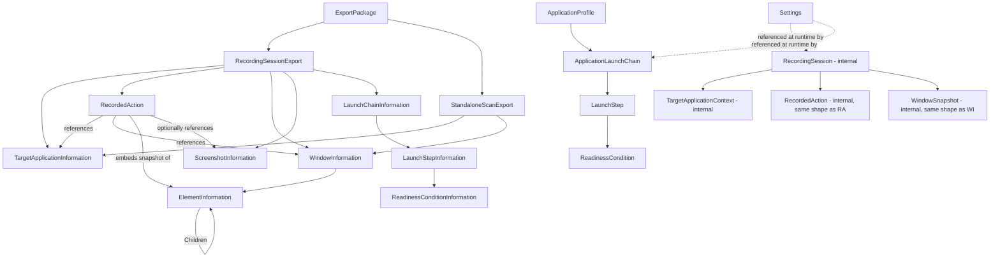

# Data Model
## Windows UI Flow Recorder & Smart UI Scanner

**Document status:** This is the field-level contract reference for every shared DTO/entity named conceptually in `Architecture.md` (§10) and behaviorally in `SystemDesign.md`. It introduces no new concepts beyond what those two documents already name. No source code is included — only properties, types, and responsibilities, sufficient for an implementing engineer or coding agent to define the actual C# types without further design decisions. `Architecture.md`, `SystemDesign.md`, and this document must always agree; if a discrepancy is ever found, this document's field-level detail wins for *shape*, while `Architecture.md`/`SystemDesign.md` win for *behavior and responsibility*.

---

## 1. Purpose & Scope

Two distinct model families exist, and keeping them distinct is a deliberate architectural decision (`Architecture.md` §1, principle 5 — "DTO/export stability"):

1. **Internal Domain Models** — live only inside the running application (Domain/Application layers) while a session is being configured, recorded, or reviewed. These may evolve freely between versions of the tool without breaking anything external.
2. **Export Contract Models** — the versioned, serialized shapes written into `export.json` (`ExportPackage` and everything beneath it). These are a public contract consumed by humans (Minh hand-writing Page Objects) and, in a future phase, by AI-assisted tooling. Once a schema version ships, its shape is frozen; changes require a new schema version.

A thin mapping step inside `ExportService` (`Architecture.md` §3.2) translates Internal Domain Models into Export Contract Models at export time. The two families intentionally share almost identical field sets for clarity, but they are **not the same types** in code.

---

## 2. Modeling Conventions

These conventions apply to every model in this document unless a field explicitly overrides one:

| Convention | Rule |
|---|---|
| Identifiers | All `*Id` fields are GUIDs, serialized as lowercase hyphenated strings (e.g. `"3fa85f64-5717-4562-b3fc-2c963f66afa6"`). IDs are generated once and never reused, even across a re-export. |
| Timestamps | All `*AtUtc` fields are ISO 8601 UTC strings with millisecond precision (e.g. `"2026-07-04T14:32:01.123Z"`). No local/offset timestamps appear anywhere in the model. |
| Enums | All enums are serialized as their string name (e.g. `"Click"`, not `0`), so exports remain human-readable and resilient to member reordering. |
| Coordinates & sizes | All bounding rectangles and points are in **physical screen pixels** (not WPF device-independent units), since they describe target-application windows/controls, not the Recorder's own UI. |
| Optional vs. required | A field marked "Required" is always present in a valid document (though it may be an empty array). A field marked "Optional" may be entirely omitted from the JSON when not applicable, rather than serialized as `null`, to keep exports compact — except where explicitly noted otherwise. |
| Collections | Ordered collections (e.g. `Actions`, `Steps`) preserve meaningful order (chronological or launch order) as emitted; consumers must not assume they need re-sorting. |
| Free-text fields | `ApplicationTag`, `Name`, `Note`, and similar free-text fields are exactly what the tester/target application supplied — no normalization, truncation, or redaction is applied (see §9, Sensitive Data Notes). |

---

## 3. Model Relationship Overview

---

## 4. Export Contract Models

### 4.1 `ExportPackage` (root document)

The single root object written to `export.json` (`Architecture.md` §10; FR-7.1–FR-7.3).

| Property | Type | Required | Description |
|---|---|---|---|
| `SchemaVersion` | string (semver, e.g. `"1.0.0"`) | Required | Version of this export contract. Consumers must check this before parsing further. |
| `ToolVersion` | string | Required | Version of the Recorder/Scanner application that produced this export. |
| `ExportedAtUtc` | timestamp | Required | When this export was written (may differ from when the session was recorded, per FR-7.4 re-export support). |
| `ExportKind` | enum: `RecordingSession`, `StandaloneScan` | Required | Discriminates which of the two nested objects below is populated. |
| `RecordingSession` | `RecordingSessionExport` | Optional (present iff `ExportKind = RecordingSession`) | The exported Flow Recorder session. |
| `StandaloneScan` | `StandaloneScanExport` | Optional (present iff `ExportKind = StandaloneScan`) | The exported Smart UI Scanner result. |

### 4.2 `RecordingSessionExport`

The exported form of a completed Flow Recorder session (FR-7.1).

| Property | Type | Required | Description |
|---|---|---|---|
| `SessionId` | guid | Required | Stable identifier of the session, unchanged across re-exports. |
| `Name` | string | Required | Tester-assigned or auto-generated session name. |
| `Note` | string | Optional | Free-text annotation (FR-8.2). |
| `CreatedAtUtc` | timestamp | Required | When the session was first configured (state `Configuring`, `SystemDesign.md` §3). |
| `StartedAtUtc` | timestamp | Required | When recording actually began (entered `Recording`). |
| `StoppedAtUtc` | timestamp | Required | When recording ended (entered `Stopped`). |
| `DurationSeconds` | number | Required | `StoppedAtUtc − StartedAtUtc`, precomputed for convenience. |
| `TerminationReason` | enum: `UserStopped`, `AllTargetsCrashedOrExited`, `Unknown` | Required | Why recording ended, per `SystemDesign.md` §3/§14. |
| `LaunchChain` | `LaunchChainInformation` | Optional | The launch-chain configuration used to start this session, if one was used (omitted for a single-application session with no chain). |
| `TargetApplications` | array of `TargetApplicationInformation` | Required | One entry per application involved in the session, in launch order. |
| `Actions` | array of `RecordedAction` | Required | All recorded actions, ordered by `SequenceNumber`. |
| `Windows` | array of `WindowInformation` | Required | All distinct windows touched during the session, each with its final captured hierarchy. |
| `Screenshots` | array of `ScreenshotInformation` | Required | Registry of every screenshot file referenced anywhere in this export. |

### 4.3 `StandaloneScanExport`

The exported form of a single Smart UI Scanner result (FR-6.4), independent of any recording session.

| Property | Type | Required | Description |
|---|---|---|---|
| `ScanId` | guid | Required | Identifier for this scan. |
| `ScannedAtUtc` | timestamp | Required | When the scan was performed. |
| `TargetApplication` | `TargetApplicationInformation` | Required | The single application that was scanned. |
| `Windows` | array of `WindowInformation` | Required | Typically one entry (the scanned window), but may include additional windows if the tester scanned more than one during the same standalone session. |

### 4.4 `TargetApplicationInformation`

One application/process involved in a session or scan (Architecture.md §10 "TargetApplicationContext", exported form).

| Property | Type | Required | Description |
|---|---|---|---|
| `ApplicationTag` | string | Required | Free-text label identifying this application within the session, e.g. `"ProxyApp"` or `"eAdminApp"`. Not used for behavior — display/grouping only. |
| `ExecutablePath` | string | Required | Full path to the executable that was launched or attached to. |
| `ProcessId` | integer | Required | OS process id at the time of capture (not stable across relaunches). |
| `LaunchOrder` | integer | Required | 1-based position in the launch chain (1 = Primary). `1` for a single-application session. |
| `LaunchedAtUtc` | timestamp | Required | When this process was successfully launched/attached. |
| `TerminatedAtUtc` | timestamp | Optional | When this process exited or was detected as crashed, if it did so before session stop. |
| `TerminationReason` | enum: `ProcessCrashed`, `ProcessExitedNormally`, `NotTerminated` | Required | `NotTerminated` if the process was still running when the session stopped. |

### 4.5 `RecordedAction`

A single captured user action (FR-3.1–FR-3.4).

| Property | Type | Required | Description |
|---|---|---|---|
| `ActionId` | guid | Required | Unique identifier for this action. |
| `SequenceNumber` | integer | Required | 1-based order of occurrence within the session; defines playback/reading order. |
| `TimestampUtc` | timestamp | Required | When the (possibly coalesced, per `SystemDesign.md` §8) action occurred. |
| `ActionType` | enum: `Click`, `RightClick`, `DoubleClick`, `Drag`, `TextEntry`, `KeyPress`, `FocusChanged`, `WindowActivated` | Required | The discrete action type after coalescing. |
| `ApplicationTag` | string | Required | Matches a `TargetApplicationInformation.ApplicationTag` in the same export — identifies which application this action occurred in. |
| `WindowId` | guid | Required | References a `WindowInformation.WindowId` in the same export — the window this action occurred in. |
| `TargetElement` | `ElementInformation` | Required for all types except `WindowActivated` | Snapshot of the element's UIA metadata at the moment of the action. For `WindowActivated`, this field is omitted since the action targets the window itself, not a control. |
| `ElementPath` | array of strings | Required (empty array allowed) | Breadcrumb of ancestor `ControlType`/`AutomationId` pairs from the window root down to `TargetElement`, e.g. `["Window", "Pane#mainPanel", "Button#submitBtn"]`, giving a human-readable location without needing to walk `WindowInformation.RootElement` manually. |
| `ScreenPoint` | object `{ X: integer, Y: integer }` | Optional | Present for `Click`, `RightClick`, `DoubleClick`, and the end-point of a `Drag`. |
| `DragStartPoint` | object `{ X: integer, Y: integer }` | Optional | Present only for `ActionType = Drag`. |
| `EnteredText` | string | Optional | Present only for `ActionType = TextEntry` — the final resolved text value of the control after coalescing (`SystemDesign.md` §8), not a per-keystroke log. |
| `KeyName` | string | Optional | Present only for `ActionType = KeyPress` — the non-printable key involved (e.g. `"Enter"`, `"Tab"`, `"Escape"`, `"F5"`). |
| `PreviousWindowId` | guid | Optional | Present only for `ActionType = WindowActivated` — the previously active window's id, if any. |
| `ScreenshotId` | guid | Optional | References a `ScreenshotInformation.ScreenshotId`, if screenshot capture was enabled for this action (FR-5.1). |

### 4.6 `WindowInformation`

A captured window and its full control hierarchy (FR-4.1–FR-4.3).

| Property | Type | Required | Description |
|---|---|---|---|
| `WindowId` | guid | Required | Identifier for this window instance, deterministically derived from the window's native OS handle (`SystemDesign.md` §9) — the same physical window always yields the same `WindowId` for the life of the session/scan, no matter how many times it is activated or re-captured. Exactly one `WindowInformation` entry exists per distinct physical window; re-captures update this same entry in place rather than producing a new one. |
| `ApplicationTag` | string | Required | Matches a `TargetApplicationInformation.ApplicationTag`. |
| `ProcessId` | integer | Required | OS process id owning this window at capture time. |
| `Title` | string | Required (empty string allowed) | Window title text at time of capture. |
| `ClassName` | string | Required | Win32/UIA class name of the window. |
| `BoundingRectangle` | object `{ X, Y, Width, Height: integer }` | Required | Window position/size in physical screen pixels. |
| `FirstCapturedAtUtc` | timestamp | Required | When this window was first captured (`SystemDesign.md` §9). |
| `LastUpdatedAtUtc` | timestamp | Required | When this window's hierarchy was last re-captured. |
| `CaptureCount` | integer | Required | How many times this window's hierarchy was (re)captured during the session — diagnostic/traceability value. |
| `RootElement` | `ElementInformation` | Required | The root of this window's control hierarchy; its `Children` form the full descendant tree. |

### 4.7 `ElementInformation`

A single UI Automation element, recursively nested to represent hierarchy (FR-3.2, FR-4.3, FR-6.2–FR-6.3).

| Property | Type | Required | Description |
|---|---|---|---|
| `ElementId` | string | Required | Identifier stable within a single `WindowInformation` capture (not guaranteed stable across re-captures if the underlying control was recreated). |
| `AutomationId` | string | Optional | UIA `AutomationId`, when the control exposes one. |
| `Name` | string | Optional | UIA `Name` property (often visible label/text). |
| `ControlType` | string | Required | UIA `ControlType` (e.g. `"Button"`, `"Edit"`, `"TreeItem"`). |
| `LocalizedControlType` | string | Optional | UIA `LocalizedControlType`, when it differs meaningfully from `ControlType`. |
| `ClassName` | string | Optional | Underlying Win32/WPF class name, when available. |
| `HelpText` | string | Optional | UIA `HelpText` property, when populated by the target application. |
| `IsEnabled` | boolean | Required | Whether the control was enabled at capture time. |
| `IsOffscreen` | boolean | Required | Whether UIA reported the control as off-screen at capture time. |
| `IsKeyboardFocusable` | boolean | Required | Whether the control can receive keyboard focus. |
| `BoundingRectangle` | object `{ X, Y, Width, Height: integer }` | Required | Control position/size in physical screen pixels. |
| `SupportedPatterns` | array of strings | Required (empty array allowed) | UIA control patterns the element supports (e.g. `"Invoke"`, `"Value"`, `"Toggle"`, `"ExpandCollapse"`, `"Selection"`). |
| `ValueOrText` | string | Optional | Current value/text content, when the element supports the `Value` or `Text` pattern (e.g. a TextBox's current contents or a Label's text). |
| `DepthInTree` | integer | Required | Distance from the window's `RootElement` (root = 0). Preserved even when `HierarchyExportScope` (§7.1) omits intermediate ancestors, per `SystemDesign.md` §17.4. |
| `WasInteractedWith` | boolean | Required (default `false`) | `true` if this element was the `TargetElement` of at least one `RecordedAction` in the session, per the matching rule in `SystemDesign.md` §17.2. Lets a reviewer or downstream tool distinguish the handful of elements the tester actually touched from the rest of the captured tree without manually cross-referencing `Actions`. |
| `InteractionCount` | integer | Required (default `0`) | How many `RecordedAction`s matched this element. |
| `InteractedActionIds` | array of guid | Required (empty array allowed) | The `ActionId`s (in `SequenceNumber` order) of every `RecordedAction` that matched this element, per `SystemDesign.md` §17.3 — lets a reader jump directly from an element in the tree to the specific action(s) that touched it. |
| `Children` | array of `ElementInformation` | Required (empty array for leaf elements) | Direct child elements, recursively of the same shape. May be pruned per `HierarchyExportScope` (§7.1, `SystemDesign.md` §17.4). |

### 4.8 `ScreenshotInformation`

Registry entry for one captured screenshot file (FR-5.1–FR-5.3, FR-7.3).

| Property | Type | Required | Description |
|---|---|---|---|
| `ScreenshotId` | guid | Required | Identifier referenced from `RecordedAction.ScreenshotId`. |
| `RelativeFilePath` | string | Required | Path relative to the export root (`SystemDesign.md` §12), e.g. `"screenshots/0007_window.png"`. Must resolve correctly when the export folder is copied elsewhere (FR-7.3). |
| `Scope` | enum: `FullScreen`, `Window`, `Element` | Required | What area of the screen this screenshot covers. |
| `Format` | enum: `PNG` | Required | Image encoding; PNG only in MVP (`SystemDesign.md` §10). |
| `Width` | integer | Required | Pixel width of the image. |
| `Height` | integer | Required | Pixel height of the image. |
| `CapturedAtUtc` | timestamp | Required | When the screenshot was captured. |
| `AssociatedActionId` | guid | Optional | The `RecordedAction` this screenshot was captured for, if any (a screenshot may also stand alone, e.g. a manual checkpoint). |
| `AssociatedWindowId` | guid | Optional | The window this screenshot depicts, when `Scope` is `Window` or `Element`. |

### 4.9 `LaunchChainInformation` / `LaunchStepInformation` / `ReadinessConditionInformation`

The exported record of the launch-chain configuration actually used for a session (traceability only — the authoritative editable version is `ApplicationLaunchChain` in §5).

| `LaunchChainInformation` property | Type | Required | Description |
|---|---|---|---|
| `ApplicationProfileId` | guid | Optional | The saved profile this chain came from, if any (a chain can also be configured ad hoc without saving). |
| `ApplicationProfileName` | string | Optional | Display name of that profile, for readability without cross-referencing. |
| `Steps` | array of `LaunchStepInformation` | Required | Ordered launch steps, step 1 = Primary. |

| `LaunchStepInformation` property | Type | Required | Description |
|---|---|---|---|
| `StepOrder` | integer | Required | 1-based order (matches `TargetApplicationInformation.LaunchOrder`). |
| `ApplicationTag` | string | Required | Matches the corresponding `TargetApplicationInformation.ApplicationTag`. |
| `ExecutablePath` | string | Required | As configured at launch time. |
| `Arguments` | string | Optional | Command-line arguments used, if any. |
| `ReadinessCondition` | `ReadinessConditionInformation` | Required | The condition that gated this step (omitted from meaning for step 1's *predecessor*, since step 1 has no predecessor to gate on — see §5.3 for how step 1 is still allowed a condition describing its own startup). |
| `ReadinessTimeoutSeconds` | integer | Required | The effective timeout used (profile override or global `Settings` default). |
| `ActualWaitDurationSeconds` | number | Required | How long the readiness poll loop actually took before succeeding — diagnostic value useful for tuning timeouts. |

| `ReadinessConditionInformation` property | Type | Required | Description |
|---|---|---|---|
| `ConditionType` | enum: `ProcessStarted`, `WindowAppeared`, `ControlPresent`, `ControlPropertyEquals`, `FixedTimeout` | Required | Which evaluation strategy was used (`SystemDesign.md` §5). |
| `Summary` | string | Required | Human-readable description of the condition as configured, e.g. `"Control [AutomationId=lblHsmStatus] Name equals \"Connected\""` — included so a reader of the export never has to reconstruct meaning from raw fields alone. |

---

## 5. Internal Domain Models

These live only within the running application. Field sets closely mirror their export counterparts above; only differences and additions are called out here to avoid duplicating every row.

### 5.1 `RecordingSession` (aggregate root during recording)

| Property | Type | Notes |
|---|---|---|
| `SessionId` | guid | Same identity carried through to `RecordingSessionExport.SessionId`. |
| `Name`, `Note` | string | Editable in place (FR-8.2) even after `Stopped`. |
| `State` | enum: `Idle`, `Configuring`, `LaunchingChain`, `Recording`, `Paused`, `Stopped`, `Reviewing`, `Exporting`, `Exported`, `LaunchFailed` | Matches `SystemDesign.md` §3 exactly. Not present in the export contract — export only exists for sessions that reached `Stopped` or later. |
| `ApplicationProfileId` | guid, optional | If the session was started from a saved profile. |
| `TargetApplicationContexts` | list of `TargetApplicationContext` (§5.2) | Live runtime handles; mapped to `TargetApplicationInformation` at export time. |
| `Actions` | ordered list of `RecordedAction` | Same shape as §4.5; appended to in real time during `Recording`. |
| `Windows` | keyed collection of `WindowSnapshot` (§5.3), keyed by `WindowId` | A single current snapshot per window, replaced in place on re-capture (`SystemDesign.md` §9) — history is not retained in MVP. |
| `CreatedAtUtc`, `StartedAtUtc`, `StoppedAtUtc` | timestamp | Same meaning as export fields; `StoppedAtUtc` is null until the session actually stops. |

### 5.2 `TargetApplicationContext` (runtime handle)

| Property | Type | Notes |
|---|---|---|
| `ApplicationTag`, `ExecutablePath`, `ProcessId`, `LaunchOrder`, `LaunchedAtUtc` | as §4.4 | Identical meaning. |
| `IsActive` | boolean | True while the process is confirmed running and its listeners are attached; flips false on crash/exit (`SystemDesign.md` §14). |
| `TerminatedAtUtc`, `TerminationReason` | as §4.4 | Populated only once `IsActive` becomes false. |

### 5.3 `WindowSnapshot` (internal equivalent of `WindowInformation`)

Identical field set to `WindowInformation` (§4.6), with two additions used only internally:

| Additional property | Type | Notes |
|---|---|---|
| `StructuralFingerprint` | string (hash) | Used by `HierarchyRecapturePolicy` (`SystemDesign.md` §9) to detect when a re-capture is warranted. Never serialized into the export — it is a purely internal optimization detail. |
| `NativeWindowHandle` | platform handle (e.g., `IntPtr`) | The OS window handle this snapshot is keyed by (`SystemDesign.md` §9's window-identity rule). Used as the lookup key to find "do I already have a `WindowSnapshot` for this physical window" before ever minting a new `WindowId`. Never serialized into the export — native handles are meaningless outside the live OS session that produced them; `WindowId` (a GUID, stable only *within* this session, derived once from the handle the first time it is seen) is the exported identifier. |

### 5.4 `ElementInfo` (internal equivalent of `ElementInformation`)

Identical field set to `ElementInformation` (§4.7), **except** `WasInteractedWith`, `InteractionCount`, and `InteractedActionIds` are *not* present on the internal `ElementInfo` type. Those three fields are computed by `ExportService` only at export time, by cross-referencing the session's `Actions` against the final captured trees (`SystemDesign.md` §17.1–§17.3) — they are a property of the *export*, not of live capture state, so the internal domain type has no need to track them during recording. Aside from this export-only addition, the two types are otherwise the same shape by design, kept as distinct types only to preserve the layering rule that Domain/Application never reference an Export-namespace type directly (`Architecture.md` §1, principle 5).

### 5.5 `ScreenshotReference` (internal equivalent of `ScreenshotInformation`)

Identical field set to `ScreenshotInformation` (§4.8), plus:

| Additional property | Type | Notes |
|---|---|---|
| `WorkingFilePath` | string (absolute path) | Absolute path into the session's working folder (`SystemDesign.md` §12) before export relocates/copies the file and rewrites it as `RelativeFilePath`. |

---

## 6. Configuration & Profile Models

### 6.1 `ApplicationProfile`

A saved, reusable target configuration (FR-1.5, FR-8.3).

| Property | Type | Required | Description |
|---|---|---|---|
| `ProfileId` | guid | Required | Stable identifier. |
| `Name` | string | Required | Display name, e.g. `"Proxy + eAdmin (HSM)"`. |
| `Description` | string | Optional | Free-text notes about this profile's purpose. |
| `CreatedAtUtc`, `LastModifiedAtUtc` | timestamp | Required | Standard audit fields. |
| `LaunchChain` | `ApplicationLaunchChain` (§6.2) | Required | The actual launch configuration this profile holds. A single-application profile is simply a chain with one step. |

### 6.2 `ApplicationLaunchChain`

| Property | Type | Required | Description |
|---|---|---|---|
| `Steps` | ordered array of `LaunchStep` (§6.3) | Required, at least 1 | Step 1 is always the Primary target; steps 2..N are Dependent targets (FR-1.2). |

### 6.3 `LaunchStep`

| Property | Type | Required | Description |
|---|---|---|---|
| `StepOrder` | integer | Required | 1-based position; must be contiguous and unique within a chain. |
| `ApplicationTag` | string | Required | Tester-supplied free-text label, e.g. `"ProxyApp"` / `"eAdminApp"` — used only for display and export tagging, never for conditional behavior. |
| `ExecutablePath` | string | Required | Path to the executable to launch. |
| `Arguments` | string | Optional | Command-line arguments. |
| `WorkingDirectory` | string | Optional | Defaults to the executable's own directory if omitted. |
| `ReadinessCondition` | `ReadinessCondition` (§6.4) | Required | The condition that must be satisfied — for step 1, this describes the Primary application's own readiness (e.g. "HSM Connected" status); for step ≥2, it is evaluated before *that* step launches, per `SystemDesign.md` §4.1. |
| `ReadinessTimeoutSecondsOverride` | integer | Optional | If omitted, falls back to `Settings.DefaultReadinessConditionTimeoutSeconds`. |
| `CleanUpOnFailure` | boolean | Required (default `true`) | Whether to terminate already-started processes in this chain if a later step's condition times out (`SystemDesign.md` §4.1(e)). |

### 6.4 `ReadinessCondition`

| Property | Type | Required | Description |
|---|---|---|---|
| `ConditionType` | enum: `ProcessStarted`, `WindowAppeared`, `ControlPresent`, `ControlPropertyEquals`, `FixedTimeout` | Required | Selects which of the fields below are meaningful (`SystemDesign.md` §5). |
| `WindowTitlePattern` | string | Optional | Used by `WindowAppeared`, `ControlPresent`, `ControlPropertyEquals` to scope the search to a specific window. |
| `WindowMatchMode` | enum: `Exact`, `Contains`, `Regex` | Optional | How `WindowTitlePattern` is matched. |
| `ElementAutomationId` | string | Optional | Used by `ControlPresent`/`ControlPropertyEquals`; at least one of `ElementAutomationId`, `ElementName`, `ElementControlType` must be set for these two condition types. |
| `ElementName` | string | Optional | See above. |
| `ElementControlType` | string | Optional | See above. |
| `ExpectedPropertyName` | enum: `Name`, `Value`, `Text` | Optional | Used only by `ControlPropertyEquals`. |
| `ExpectedPropertyValue` | string | Optional | Used only by `ControlPropertyEquals`. |
| `PropertyMatchMode` | enum: `Exact`, `Contains`, `Regex` | Optional | How `ExpectedPropertyValue` is matched against the live property. |
| `FixedTimeoutSeconds` | integer | Optional | Used only by `ConditionType = FixedTimeout`. |

**Worked example (Proxy App → eAdmin App, HSM scenario):** Step 1 (`ApplicationTag = "ProxyApp"`) has `ReadinessCondition.ConditionType = ControlPropertyEquals`, `WindowTitlePattern = "Proxy*"`, `ElementAutomationId = "lblHsmStatus"`, `ExpectedPropertyName = Value`, `ExpectedPropertyValue = "Connected"`, `PropertyMatchMode = Contains`. Step 2 (`ApplicationTag = "eAdminApp"`) has `ReadinessCondition.ConditionType = WindowAppeared`, `WindowTitlePattern = "eAdmin*"`, `WindowMatchMode = Contains`.

---

## 7. Settings Model

### 7.1 `Settings` (global, persisted via `ISettingsRepository`)

| Property | Type | Required | Description |
|---|---|---|---|
| `ScreenshotMode` | enum: `EveryAction`, `WindowChangeOnly`, `ManualCheckpointOnly`, `Off` | Required (default `EveryAction`) | Controls FR-5.1 behavior. |
| `CaptureElementCroppedScreenshot` | boolean | Required (default `false`) | Enables FR-5.3's additional element-bounded screenshot. |
| `HierarchyRecaptureSensitivity` | enum: `Low`, `Medium`, `High` | Required (default `Medium`) | Maps internally to the minimum re-capture interval used by `HierarchyRecapturePolicy` (`SystemDesign.md` §9); exact millisecond mapping is an implementation detail owned by that policy, not this data model. |
| `DefaultExportDirectory` | string (path) | Optional | Pre-fills the export dialog; if unset, the tester chooses a location each time. |
| `DefaultReadinessConditionTimeoutSeconds` | integer | Required (default `30`) | Used by any `LaunchStep` that does not set `ReadinessTimeoutSecondsOverride`. |
| `DefaultReadinessPollIntervalMilliseconds` | integer | Required (default `250`) | Used by `ApplicationLaunchOrchestrator` (`SystemDesign.md` §4.1). |
| `MaxHierarchyElementCount` | integer | Required (default `5000`) | Safety cap referenced in `SystemDesign.md` §9. |
| `HierarchyExportScope` | enum: `FullTree`, `InteractedElementsWithAncestorPath`, `InteractedElementsOnly` | Required (default `FullTree`) | Controls how much of each captured window's control tree is included in an export, per the pruning rules in `SystemDesign.md` §17.4 — lets a tester trade full context (default) for a leaner export focused on what was actually interacted with. Applies to both Flow Recorder session exports and standalone Smart UI Scanner exports. |
| `VerboseDiagnosticLoggingEnabled` | boolean | Required (default `false`) | Opt-in logging that may include captured UI text content (`SystemDesign.md` §16) — must remain off by default. |
| `LastModifiedAtUtc` | timestamp | Required | Standard audit field. |

---

## 8. Supporting Projection Model

### 8.1 `SessionListItem`

A lightweight, non-exported projection used only to render FR-8.1's session list without loading each full `RecordingSession`.

| Property | Type | Required | Description |
|---|---|---|---|
| `SessionId` | guid | Required | Matches the underlying session. |
| `Name` | string | Required | Display name. |
| `CreatedAtUtc` | timestamp | Required | For sorting/filtering. |
| `DurationSeconds` | number | Required | Precomputed for display. |
| `TargetApplicationTags` | array of strings | Required | e.g. `["ProxyApp", "eAdminApp"]`, for at-a-glance context. |
| `ActionCount`, `WindowCount`, `ScreenshotCount` | integer | Required | Summary counts shown in the list (also mirrors the FR-2.4 summary screen). |
| `Note` | string | Optional | Shown as a subtitle/tooltip in the list. |

---

## 9. Schema Versioning & Compatibility Policy

- `ExportPackage.SchemaVersion` follows semantic versioning (`MAJOR.MINOR.PATCH`).
- A **PATCH** increment means clarification only — no field added, removed, or renamed.
- A **MINOR** increment may add new optional fields; existing consumers ignoring unknown fields remain compatible.
- A **MAJOR** increment may remove or rename fields, or change a field's type/meaning; consumers must check `SchemaVersion` before assuming shape.
- `ExportService` (`Architecture.md` §3.2) validates every export against its declared `SchemaVersion` before writing (PRD NFR "Data integrity"); a validation failure must block the write rather than produce a partially-invalid file.
- Internal Domain Models (§5) carry no independent version number — they are never persisted outside this application's own working session storage (`SystemDesign.md` §12), which is allowed to change shape freely between tool versions since it is not a public contract.

### 9.1 Schema Changelog

| Version | Change | Type |
|---|---|---|
| `1.0.0` | Initial MVP export contract (§4). | — |
| `1.1.0` | Added `WasInteractedWith`, `InteractionCount`, `InteractedActionIds` to `ElementInformation` (§4.7); added `HierarchyExportScope` to `Settings` (§7.1); no existing field removed, renamed, or reinterpreted. | MINOR — purely additive; a consumer built against `1.0.0` that ignores unknown fields reads a `1.1.0` export without modification. |

Future entries are appended to this table, never inserted out of order, so the changelog itself remains a reliable audit trail of the export contract's history.

---

## 10. Sensitive Data Notes

- `ElementInformation.ValueOrText`, `RecordedAction.EnteredText`, and all `ScreenshotInformation` image content necessarily contain whatever text/visuals the target application rendered, which may include business data visible on screen during the test pass.
- No field in this data model is redacted, masked, or filtered by the tool itself (`SystemDesign.md` §16); responsibility for handling the resulting export's contents according to the tester's environment's data-handling policy rests with the tester and the export's destination, not with the application.
- No field in this data model is ever transmitted off the local machine; every model in this document is written only to local disk (`SystemDesign.md` §12) or held in memory.
