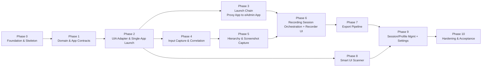

# Roadmap
## Windows UI Flow Recorder & Smart UI Scanner

**Document status:** Defines the phased implementation sequence for building the system specified in `PRD.md`, `Architecture.md`, and `SystemDesign.md`. Phases are additive and dependency-ordered: each phase produces a demonstrable, testable increment, and no phase requires rework of a prior phase's architecture. This document does not introduce new requirements or components — every deliverable below maps back to a Functional Requirement (FR-x) in `PRD.md` or a component named in `Architecture.md`/`SystemDesign.md`.

---

## 1. Sequencing Principles

1. **Inside-out delivery** — Domain and Application-layer contracts are built before any Infrastructure or Presentation code touches them, per Clean Architecture (Architecture.md §3). This lets Domain/Application be fully unit-tested with fakes before any real FlaUI/WPF code exists.
2. **Single-application before multi-application** — basic recording against one target app is proven end-to-end before the `ApplicationLaunchChain`/Proxy App → eAdmin App scenario is layered on, so complexity is introduced incrementally rather than all at once.
3. **Capture before export before UI polish** — the capture pipeline (input, UIA correlation, hierarchy, screenshots) must be correct and tested before the export contract is finalized, and both must be solid before Presentation-layer UX refinement.
4. **Two MVP components, not two release tracks** — Flow Recorder and Smart UI Scanner share almost all Infrastructure (the UIA adapter in particular); the Scanner is scheduled after the shared adapter is proven by the Recorder, to avoid building the same capability twice.

---

## 2. Phase 0 — Foundation & Project Skeleton

**Goals:** Stand up the solution structure exactly as defined in Architecture.md §4, with empty-but-compiling layers, DI wiring, logging, and the architectural guardrails that every later phase relies on.

**Deliverables:**
- Solution and four projects created (`Domain`, `Application`, `Infrastructure`, `Presentation`) plus their four mirrored test projects, matching Architecture.md §4 exactly.
- `Microsoft.Extensions.DependencyInjection` composition root in `Presentation/App.xaml.cs` with empty `AddDomainLayer`/`AddApplicationLayer`/`AddInfrastructureLayer`/`AddPresentationLayer` extension methods wired together.
- `Microsoft.Extensions.Logging` configured with the local-only file sink (SystemDesign.md §12 Logs folder).
- The automated "no network access" architecture test (Architecture.md §9.3) written and passing against the empty skeleton, so it is enforced from commit one.
- Local app-data folder bootstrap (`Profiles`, `Sessions`, `Settings`, `Logs` per SystemDesign.md §12) created on first run.

**Dependencies:** None (first phase).

**Estimated complexity:** Low.

**Risks:** Low risk of rework later if the project/namespace structure deviates from Architecture.md §4 — mitigated by treating that section as literal, not illustrative.

---

## 3. Phase 1 — Domain & Application Contracts

**Goals:** Implement every Domain entity and Application-layer interface as pure contracts, fully unit-testable with no real automation, process, or file dependencies.

**Deliverables:**
- Domain entities: `RecordingSession`, `TargetApplicationContext`, `RecordedAction`, `WindowSnapshot`, `ElementInfo`, `ApplicationLaunchChain`, `ReadinessCondition`, `ScreenshotReference`, `ApplicationProfile` (Architecture.md §3.1).
- Domain policies as pure logic: `ActionCoalescingPolicy`, `HierarchyRecapturePolicy` (SystemDesign.md §8, §9), unit-testable with plain input/output values.
- Application-layer interfaces: `IUiAutomationProvider`, `IProcessLaunchMonitor`, `IScreenshotCapturer`, `IGlobalInputHook`, `ISessionRepository`, `IApplicationProfileRepository`, `ISettingsRepository`, `IExportWriter` (Architecture.md §3.2), with no implementations yet — only signatures and XML-doc-level contracts.
- Application-layer service skeletons (`RecordingSessionService`, `ApplicationLaunchOrchestrator`, `UiScanService`, `ExportService`, `ApplicationProfileService`, `SettingsService`) implemented against the interfaces above, using hand-written in-memory fakes in tests (no Infrastructure exists yet).
- Full unit test coverage of Domain policies and Application orchestration logic using fakes/mocks (Moq) per TestingStrategy.md, since this phase is where the majority of pure business-logic tests are written.

**Dependencies:** Phase 0.

**Estimated complexity:** Medium — the coalescing and re-capture-sensitivity policies (SystemDesign.md §8–§9) require careful edge-case design even before any real UIA data exists.

**Risks:** If entity shapes are wrong here, every later phase inherits the fix; mitigated by finalizing `DataModel.md` field-level shapes before this phase's entities are considered done.

---

## 4. Phase 2 — UIA Adapter & Single-Application Launch

**Goals:** Implement the first real Infrastructure adapters and prove the system can launch and inspect exactly one real target application end-to-end.

**Deliverables:**
- `FlaUiAutomationProvider` (implements `IUiAutomationProvider`) wrapping FlaUI's `UIA3Automation` — element lookup by point, by focus, `FindFirst`/`FindAll`, property reads, translated into plain `ElementInfo`/`WindowSnapshot` data (Architecture.md §3.3).
- `ProcessLaunchMonitor` (implements `IProcessLaunchMonitor`) — start process, detect exit, enumerate top-level windows for a single process (SystemDesign.md §4.1 steps (a)–(b) only; chain logic comes in Phase 3).
- A minimal internal test harness target app (a small throwaway WPF/WinForms app with known AutomationIds) used across Infrastructure and integration tests so tests do not depend on the real Proxy App/eAdmin App being available in every dev environment.
- Integration tests proving: launch a single real process, find a known element by AutomationId, read its properties, detect process exit.

**Dependencies:** Phase 1 (interfaces must exist and be stable).

**Estimated complexity:** Medium-High — first contact with real UIA3/COM behavior (stale elements, timing) as described in SystemDesign.md §7.

**Risks:** UIA coverage gaps on certain control types (RiskAnalysis.md) may first surface here; establishing the "treat staleness as expected, not exceptional" pattern (SystemDesign.md §7, §14) early avoids brittle code in later phases.

---

## 5. Phase 3 — Application Launch Chain (Proxy App → eAdmin App)

**Goals:** Implement the full `ApplicationLaunchOrchestrator` and all `ReadinessCondition` types, validated against the concrete Proxy App / HSM / eAdmin App reference scenario.

**Deliverables:**
- `ApplicationLaunchOrchestrator` implementing the sequential launch algorithm (SystemDesign.md §4.1): per-step launch, readiness polling, timeout/abort, optional cleanup-on-failure.
- All five `ReadinessCondition` evaluators (process-started, window-appeared, control-present, control-property-equals, fixed-timeout) per SystemDesign.md §5, each unit-tested against the Phase 2 test harness app (simulating a "status control" that changes text, to stand in for the HSM-connected indicator).
- End-to-end integration test using two instances of the test harness app configured as a 2-step chain (mirroring Proxy App → eAdmin App), including a deliberate "condition never met" test proving clean abort behavior (PRD Acceptance Criteria #2).
- `ApplicationProfileService` + `JsonFileProfileRepository` sufficient to save/load a launch-chain profile (full CRUD UI comes later in Phase 9; this phase only needs the service/repository layer working).

**Dependencies:** Phase 2.

**Estimated complexity:** High — this is the most product-differentiating and failure-sensitive piece of the system; timeout/abort/cleanup edge cases (SystemDesign.md §4.1(e), §14) need thorough test coverage.

**Risks:** Readiness-condition fragility (RiskAnalysis.md) is most visible here; mitigated by supporting pattern/contains matching (not only exact string match) from the start, per SystemDesign.md §5.

---

## 6. Phase 4 — Input Capture & Correlation Pipeline

**Goals:** Implement global input hooking and its correlation to UIA elements, independent of full recording-session orchestration.

**Deliverables:**
- `GlobalInputHook` (implements `IGlobalInputHook`) — dedicated hook thread, bounded producer/consumer queue, heartbeat detection (SystemDesign.md §6, §14).
- Correlation logic in `RecordingSessionService`: point-based and focus-based element lookup, process-id scoping to active `TargetApplicationContext`s (SystemDesign.md §7).
- `ActionCoalescingPolicy` wired against real (not simulated) input events: drag/gesture coalescing, text-entry coalescing, duplicate window-activation collapsing (SystemDesign.md §8).
- Integration tests driving synthetic input (e.g., `SendInput`-based test helpers) against the Phase 2 test harness app to validate end-to-end capture → correlation → coalescing without any UI yet.

**Dependencies:** Phase 2 (needs a working `IUiAutomationProvider`); can proceed in parallel with Phase 3.

**Estimated complexity:** High — low-level hook thread safety and coalescing timing windows are inherently fiddly to get right and to test deterministically.

**Risks:** Hook-thread stalls silently disabling capture (SystemDesign.md §14) — the heartbeat/warning mechanism must be built and tested in this phase, not retrofitted later.

---

## 7. Phase 5 — Window Hierarchy Capture & Screenshot Capture

**Goals:** Implement full hierarchy walking with change-detection re-capture, and the screenshot capture pipeline.

**Deliverables:**
- Depth-first hierarchy walker in `FlaUiAutomationProvider` with the max-element-count safety limit (SystemDesign.md §9).
- Structural fingerprinting and re-capture-trigger logic wired to `HierarchyRecapturePolicy` from Phase 1.
- `ScreenshotCapturer` (implements `IScreenshotCapturer`) — full-screen, window-bounded, and element-bounded capture, async file writes, backpressure/degradation behavior (SystemDesign.md §10).
- Performance tests validating the ≤3s / ≤2,000-element hierarchy-scan budget (PRD NFR, SystemDesign.md §13) against the test harness app scaled up with generated controls.

**Dependencies:** Phase 2.

**Estimated complexity:** Medium.

**Risks:** Large/complex real target windows may exceed the performance budget — mitigated by the max-depth/max-element safety limit being configurable, and by profiling against realistic Proxy App/eAdmin App-sized windows as soon as they are available for testing, not only the synthetic harness.

---

## 8. Phase 6 — Recording Session Orchestration & Flow Recorder UI

**Goals:** Assemble Phases 3–5 into the full `RecordingSessionService` state machine and build the first real Presentation-layer feature: the Flow Recorder.

**Deliverables:**
- Full session state machine implemented per SystemDesign.md §3 (Idle → Configuring → LaunchingChain → Recording/Paused → Stopped → Reviewing).
- Threading model assembled exactly as SystemDesign.md §11 specifies (UI thread, hook thread, capture-processing thread, transient poll threads).
- Flow Recorder WPF views/ViewModels: Target Application Selection (single app and Launch Chain Builder), Start/Pause/Resume/Stop controls, always-on-top Recording Status Overlay (including the "capture may be incomplete" warning from SystemDesign.md §14), Session Summary/Review screen.
- `JsonFileSessionRepository` implemented sufficiently to persist a working session (full session-list UI comes in Phase 9).
- End-to-end manual/scripted test: configure the real (or harness) 2-step launch chain, record ≥10 actions across ≥2 windows, stop, and inspect the in-memory session — satisfying the bulk of PRD Acceptance Criteria #1–#4 short of export.

**Dependencies:** Phases 3, 4, 5.

**Estimated complexity:** High — this is the first phase where every prior subsystem must work together correctly under real timing conditions.

**Risks:** Integration risk is highest here; mitigated by having each contributing subsystem already independently tested in its own phase.

---

## 9. Phase 7 — Export Pipeline

**Goals:** Implement the versioned export contract and writer, turning a completed `RecordingSession` into a portable `ExportPackage`.

**Deliverables:**
- `ExportPackage` DTO graph and all nested export DTOs, per `DataModel.md`.
- `ExportService` mapping logic (domain aggregate → DTOs) and self-validation against the declared schema version before write (PRD NFR "Data integrity").
- `ExportWriter` (implements `IExportWriter`) — writes `export.json`, relocates/copies screenshots into the export folder, rewrites references as relative paths (SystemDesign.md §12, FR-7.3).
- Re-export support (FR-7.4) proven by exporting the same completed session twice to different folders.
- Schema-validation automated tests: every exported sample session must validate against its declared schema version (PRD Acceptance Criteria #7).

**Dependencies:** Phase 6 (needs a real completed session to export) and `DataModel.md` finalized.

**Estimated complexity:** Medium.

**Risks:** Export-format churn late in the project is expensive for downstream consumers — mitigated by treating `DataModel.md`'s shapes as frozen once this phase begins, per Architecture.md §1 principle 5.

---

## 10. Phase 8 — Smart UI Scanner

**Goals:** Deliver the second MVP component, reusing the Phase 2/5 UIA adapter and the Phase 7 export contract, independent of any recording session.

**Deliverables:**
- `UiScanService` — on-demand `ScanWindow` using the same hierarchy walker as Phase 5, without requiring an active `RecordingSession`.
- Scanner WPF views/ViewModels: target picker, hierarchy tree with search/filter by AutomationId/Name/ControlType/ClassName (FR-6.2), element details panel, on-screen highlight overlay (FR-6.3).
- Standalone export path through the existing `ExportService`/`ExportWriter` (FR-6.4), proving the shared schema truly is shared, not duplicated.

**Dependencies:** Phase 2 (adapter), Phase 7 (export contract). Can start once both are stable; does not depend on Phase 6.

**Estimated complexity:** Medium — most of the hard problems (hierarchy walking, export) are already solved by this point; this phase is primarily UI and search/filter/highlight work.

**Risks:** Low, provided Phase 2/7 contracts are respected rather than re-implemented.

---

## 11. Phase 9 — Session & Profile Management, Settings

**Goals:** Complete the remaining FR-8/FR-9 management surfaces so the tool is usable day-to-day without manual file editing.

**Deliverables:**
- Session List UI (FR-8.1) backed by `JsonFileSessionRepository` metadata queries; rename/annotate/delete (FR-8.2).
- Application Profile management UI: view/edit/duplicate/delete (FR-8.3), completing the Launch Chain Builder started in Phase 6.
- Settings UI and `SettingsService`/`JsonFileSettingsRepository` for all FR-9.1 options (screenshot mode, hierarchy sensitivity, default export directory, default readiness timeout), applied live without restart where feasible (FR-9.2).

**Dependencies:** Phases 6, 7, 8 (touches data produced/consumed by all of them).

**Estimated complexity:** Low-Medium.

**Risks:** Low.

---

## 12. Phase 10 — Hardening, Performance Validation & Acceptance

**Goals:** Close out all PRD Acceptance Criteria and NFR budgets; prepare a single internal build for release.

**Deliverables:**
- Full pass against every PRD.md §13 Acceptance Criterion, including the real Proxy App / eAdmin App target applications (not just the test harness), per the PRD's Success Metric of ≥95% launch-chain success rate.
- Performance validation against every SystemDesign.md §13 budget on the reference hardware baseline.
- The "no network access" architecture test (Phase 0) re-run as a final gate, plus a manual/instrumented audit for the Offline-operation NFR.
- Crash/recovery scenarios (SystemDesign.md §14) explicitly exercised: kill Proxy App mid-session, kill eAdmin App mid-session, disk-full during export, etc.
- Packaging of a single installable/portable build per PRD §14 Release Plan.

**Dependencies:** All prior phases.

**Estimated complexity:** Medium (breadth of validation, not new architecture).

**Risks:** Real target-application quirks (as opposed to the test harness) may surface late; mitigated by pulling real Proxy App/eAdmin App access into testing as early as Phase 3/6 where feasible, rather than deferring all real-app testing to this phase.

---

## 13. Traceability Summary

| Phase | Primary PRD FRs covered | Primary Architecture/SystemDesign components |
|---|---|---|
| 0 | — (foundation) | Solution structure (Architecture.md §4), DI/logging (§9.1–9.2) |
| 1 | — (foundation) | Domain entities/policies, Application interfaces (§3.1–3.2) |
| 2 | FR-1.1 | `FlaUiAutomationProvider`, `ProcessLaunchMonitor` |
| 3 | FR-1.2–FR-1.5 | `ApplicationLaunchOrchestrator`, `ReadinessCondition` |
| 4 | FR-3.1–FR-3.4 | `GlobalInputHook`, coalescing (SystemDesign.md §6, §8) |
| 5 | FR-4.1–FR-4.3, FR-5.1–FR-5.3 | Hierarchy walker, `ScreenshotCapturer` |
| 6 | FR-2.1–FR-2.4 | `RecordingSessionService`, Recorder UI |
| 7 | FR-7.1–FR-7.4 | `ExportService`, `ExportWriter` |
| 8 | FR-6.1–FR-6.4 | `UiScanService`, Scanner UI |
| 9 | FR-8.1–FR-8.3, FR-9.1–FR-9.2 | `ApplicationProfileService`, `SettingsService` |
| 10 | All Acceptance Criteria | Full system |
