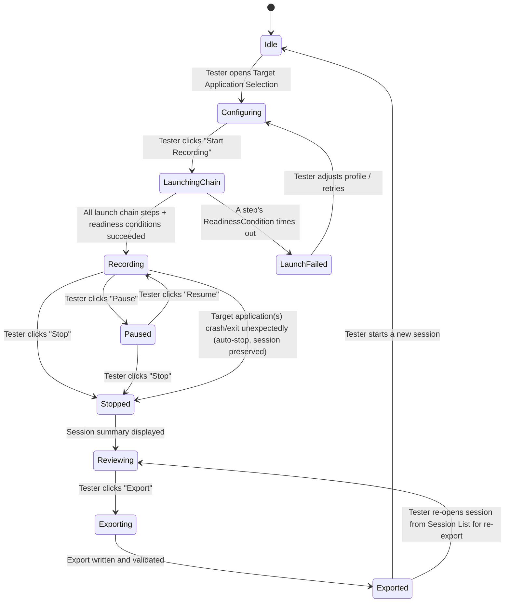
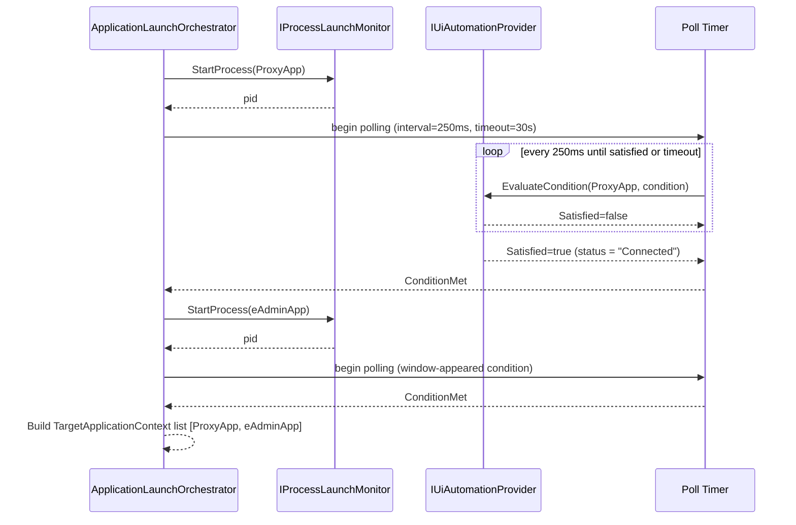

# System Design Document
## Windows UI Flow Recorder & Smart UI Scanner

**Document status:** This document sits between `Architecture.md` (structure/layers/contracts) and `DataModel.md` (field-level schemas). It defines *runtime behavior*: state machines, algorithms, threading, timing budgets, file layout, and failure handling — detailed enough that an implementing engineer or coding agent does not need to make further design decisions. It must not introduce any component, interface, or entity not already named in `Architecture.md`. No source code is included.

---

## 1. Purpose & Scope

`Architecture.md` defines *what* the layers and components are and how they depend on each other. This document defines *how they behave at runtime*: what happens, in what order, on what thread, with what timing, and what happens when something fails. It is grounded throughout in the reference scenario from the PRD: a **Proxy App** that must reach an HSM-connected state before the **eAdmin App** is launched — used here as the concrete worked example for the generic `ApplicationLaunchChain` design.

---

## 2. Runtime Topology

At runtime there are always at least two, and typically three, separate OS processes involved:

| Process | Owned by | Notes |
|---|---|---|
| **Recorder Process** | This application (`WindowsUiFlowRecorder.Presentation.exe`) | .NET 8 process; hosts WPF UI thread, capture pipeline, UIA3 automation client, DI container. |
| **Proxy App Process** | Target under test (Primary) | Independent process, any Windows UI technology/.NET runtime (e.g., .NET Framework 4.8). The Recorder only talks to it via UI Automation (out-of-process COM) and OS process APIs — never in-process. |
| **eAdmin App Process** | Target under test (Dependent) | Same as above; launched only after the Proxy App's `ReadinessCondition` is satisfied. |

The Recorder process never loads code into, or injects into, a target process. All interaction is through: (a) the UI Automation provider (out-of-process, via FlaUI/UIA3), (b) `Process.Start`/process monitoring APIs, and (c) OS-level input hooking (which observes global input, not target-process internals). This is what allows the Recorder to remain .NET 8 while targets run .NET Framework 4.8 or any other Windows UI stack.

---

## 3. Recording Session State Machine



**Rules:**
- A session can only transition `LaunchingChain → Recording` after *every* step of the `ApplicationLaunchChain` has satisfied its `ReadinessCondition` (see §4). Partial success is not a valid state — the session either fully starts or aborts to `LaunchFailed`.
- `Recording → Stopped` triggered by an unexpected target crash must preserve every `RecordedAction`/`WindowSnapshot` captured up to that point (NFR "Reliability" in PRD.md) and must record the crash as a terminal event on the affected `TargetApplicationContext`, not silently truncate the session.
- `Exported` sessions remain re-exportable indefinitely (FR-7.4) without re-entering `Recording`.

---

## 4. Application Launch Chain Execution Design

This is the runtime algorithm behind `ApplicationLaunchOrchestrator` (owned by the Application layer, per Architecture.md §3.2), worked through using the Proxy App → eAdmin App scenario.

### 4.1 Execution algorithm

1. Load the `ApplicationLaunchChain` from the selected `ApplicationProfile` (Step 1 = Primary = Proxy App; Step 2..N = Dependent = eAdmin App and any further steps).
2. For the current step:
   a. Start the process via `IProcessLaunchMonitor.StartProcess(path, arguments, workingDirectory)`.
   b. If the process fails to start at the OS level (bad path, access denied), abort immediately with a `LaunchChainResult.Failure` naming this step and the OS error — do not enter a readiness-polling loop for a process that never started.
   c. Begin polling the step's `ReadinessCondition` (see §5) at a fixed poll interval (default 250ms, configurable) until either the condition is satisfied or the step's timeout elapses (default 30s, configurable per PRD FR-9.1's "default readiness-condition timeout").
   d. If satisfied: record the `TargetApplicationContext` for this step (process id, application tag, e.g. `"ProxyApp"`) and proceed to the next step.
   e. If timeout elapses first: abort the entire chain (do not proceed to launch remaining steps), terminate any processes already started by this chain execution **only if** the profile is configured to "clean up on failure" (default: on — configurable, since a tester may want the partially-launched app left open to diagnose), and return `LaunchChainResult.Failure` naming the failed step and the unmet condition.
3. Once all steps succeed, return `LaunchChainResult.Success` with the full ordered list of `TargetApplicationContext`s. `RecordingSessionService` then subscribes input/UIA listeners to all of them (§6, §7) before transitioning to `Recording`.

### 4.2 Concrete worked example (Proxy App / eAdmin App / HSM)

| Step | Target | Readiness Condition | Typical evaluation |
|---|---|---|---|
| 1 (Primary) | Proxy App | Control-property-equals: a named status control's text equals `"Connected"` (or matches a configured pattern) | Poll: find element by AutomationId/Name within the Proxy App's main window; compare its Name/Value property each poll cycle |
| 2 (Dependent) | eAdmin App | Process-started + window-appeared (eAdmin's own main window becomes visible) | Poll: process exists AND has ≥1 visible top-level window |

This is not hardcoded — the same engine supports any N-step chain with any mix of condition types per step; Proxy/eAdmin/HSM is simply the profile a tester configures using this generic mechanism.

### 4.3 Sequence (detail beyond Architecture.md §7.1)



---

## 5. Readiness Condition Evaluation Design

Each `ReadinessCondition` type (Architecture.md §10) is evaluated as follows:

| Condition type | Evaluation logic | Failure mode handled |
|---|---|---|
| Process-started | `Process` exists and has not exited | Process exits immediately after start (crash-on-launch) → immediate failure, no need to wait for timeout |
| Window-appeared | Enumerate top-level windows owned by the process; match by title (exact/contains/regex, configurable) or by root AutomationId | Window created but immediately closed (splash screen) → poll must re-check, not cache a stale positive |
| Control-present | `FindFirst`/`FindAll` scoped to the target window, matched by AutomationId, Name, and/or ControlType | Control exists but is not yet in a stable state (e.g., still constructing) → this condition only checks *presence*, not value; use control-property-equals when a specific state matters |
| Control-property-equals | Same lookup as control-present, then compare `Name`/`Value`/text-pattern content against an expected literal or pattern (exact match or contains, configurable) | Property read throws (element went stale between poll cycles) → treated as "not yet satisfied," not as a fatal error, and polling continues |
| Fixed-timeout (fallback) | Waits a fixed duration then reports satisfied unconditionally | Documented in PRD as a fallback only; using it means the orchestrator cannot distinguish "ready" from "not ready," so it is discouraged for anything but throwaway/manual profiles |

**Polling discipline:** all polling is time-boxed by the step timeout; the orchestrator never polls indefinitely. Each poll cycle that throws an unexpected (non-"element not found/stale") exception is logged and counted; if a step accumulates more than a configurable number of unexpected exceptions (default 5) before its timeout, the step fails early with that error surfaced, rather than waiting out the full timeout on a condition that is structurally broken (e.g., wrong AutomationId configured).

---

## 6. Input Capture Subsystem Design

- Implemented by `GlobalInputHook` (Infrastructure), consumed by `RecordingSessionService` (Application) via `IGlobalInputHook`.
- Uses OS-level low-level global mouse and keyboard hooks scoped to the whole desktop session (not per-process), because the Recorder must observe input across every window in the launch chain (Proxy App, eAdmin App, and any child dialogs) without cooperation from those target processes.
- Runs its own dedicated message-pump thread (a hook of this kind requires a thread with a live Windows message loop); this thread is never the WPF UI thread and never the UIA polling thread, to avoid blocking either.
- Raw events are pushed onto a thread-safe, bounded producer/consumer queue; `RecordingSessionService` drains the queue on a dedicated capture-processing thread, so a slow UIA lookup or screenshot write never delays the OS hook callback (a slow hook callback can cause the OS to silently disable the hook).
- Only events relevant to FR-3.1 (clicks, key presses, text entry, focus/window change) are retained; raw mouse-move events not part of a drag/gesture are discarded at the hook boundary and never reach the coalescing stage.

---

## 7. UI Automation Correlation Design

- On each retained input event, `RecordingSessionService` asks `IUiAutomationProvider` for the `AutomationElement` at the event's screen point (for clicks) or the currently focused element (for keyboard input and focus-change events).
- Element lookups are matched against the set of active `TargetApplicationContext`s by process id; an event whose element belongs to a process outside the current launch chain (e.g., the tester briefly alt-tabs to an unrelated app) is recorded as a window-deactivation boundary but is **not** added as a `RecordedAction`, per FR-3's intent that captured actions are scoped to the applications under test.
- Focus-changed and window-activated UIA events are subscribed per `TargetApplicationContext` at session start (Architecture.md §7.1) so that a window opened *after* recording starts (e.g., a modal dialog spawned by eAdmin App) is automatically discovered without the tester needing to reconfigure anything.
- Element references from UIA are inherently short-lived/can go stale; every correlation step re-resolves fresh metadata into the plain `ElementInfo` data shape at the moment of the action rather than holding onto a live `AutomationElement` reference, so nothing in the capture pipeline depends on stale native handles surviving past a single lookup.

---

## 8. Action Coalescing Algorithm

Purpose: turn raw retained input events into meaningful discrete `RecordedAction`s (FR-3.4).

- **Drag/continuous gestures:** a mouse-down followed by mouse-move events followed by mouse-up on the same element (or a drag onto a different element) within a configurable maximum gesture duration (default 2s) is coalesced into a single action (e.g., a "drag" or, if start/end element are identical and displacement is below a small pixel threshold, simply a "click").
- **Text entry:** consecutive individual key-press events that produce printable text into the *same* focused control, with no intervening focus change and no gap longer than a configurable idle threshold (default 1.5s), are coalesced into a single "text entry" action carrying the final resulting text value of that control, rather than one action per keystroke. A non-printable key (Enter, Tab, Escape, function keys) always ends the current text-entry coalescing window and is itself recorded as its own discrete key-press action.
- **Duplicate window-activation events:** rapid repeated "window activated" events for the same window (which the OS can sometimes fire more than once) are collapsed to a single `WindowSnapshot` touch rather than duplicated entries.
- Coalescing windows are evaluated on the capture-processing thread (§6) and never block the input-hook thread.

---

## 9. Window Hierarchy Capture & Re-capture Sensitivity Design

- **Initial capture:** the first time a window belonging to a tracked `TargetApplicationContext` is activated, `IUiAutomationProvider` performs a depth-first walk of its descendant elements up to a configurable maximum depth (default: unlimited, but capped by a max-element-count safety limit, default 5,000, to bound worst-case scan time per NFR "Performance — hierarchy scan").
- **Change detection for re-capture (FR-4.2):** after the initial capture, the tool computes a lightweight structural fingerprint of the window (e.g., a hash derived from child count per container, the ordered list of ControlTypes/AutomationIds at each level) rather than a full content hash of every property, so that detecting "did the structure change" is cheap enough to check frequently.
- **Re-capture trigger:** a re-capture is scheduled when (a) a UIA structure-changed event fires for the window, or (b) the next recorded action targets that window and the fingerprint has changed since the last capture — whichever happens first — subject to a minimum re-capture interval (default 500ms, configurable via the "hierarchy re-capture sensitivity" setting in FR-9.1) to avoid thrashing on windows that mutate continuously (e.g., a live-updating status field).
- Re-captures replace the window's stored `WindowSnapshot` in the session aggregate; prior captures of the same window are not retained as separate history entries in MVP (a single current snapshot per window, refreshed in place) — full versioned hierarchy history is noted as a candidate in FutureEnhancements.md.

---

## 10. Screenshot Capture Design

- Screenshots are captured on the capture-processing thread (never the hook thread), immediately after an action's `ElementInfo`/`WindowSnapshot` correlation completes (§7), per the mode configured in Settings (FR-5.1: every action / on window change only / on manual checkpoint / off).
- Capture targets, depending on settings: full virtual-screen bitmap, the owning window's bounding rectangle only, and/or (if FR-5.3 is enabled) a crop of just the target element's bounding rectangle.
- Images are encoded to PNG (lossless, since screenshots may be inspected closely for automation authoring) and written asynchronously to the session's working screenshot folder using a sequential, predictable naming convention (`{sessionId}/screenshots/{actionSequenceNumber}_{scope}.png`, where `{scope}` is `full`, `window`, or `element`), so that references stored on the in-progress `RecordedAction` are simple relative filenames resolvable at export time.
- Screenshot writes are queued and backpressured: if the write queue exceeds a safety threshold (indicating disk I/O is falling behind capture rate), the tool degrades gracefully by temporarily downgrading capture scope (e.g., window-only instead of full-screen) rather than blocking the tester's input, and logs a warning.

---

## 11. Concurrency & Threading Model

| Thread | Owns | Never does |
|---|---|---|
| WPF UI thread (Dispatcher) | All View/ViewModel updates, user interaction | Direct UIA calls, direct file I/O, direct process launch — always marshals to Application-layer services which internally hop to background threads |
| Input hook thread | OS-level global hook message pump | Any UIA lookup, any file write, any coalescing logic — only pushes raw events to the queue |
| Capture-processing thread | Draining input queue, coalescing, UIA correlation, triggering screenshot capture, appending to the in-memory `RecordingSession` aggregate | Blocking waits longer than the poll intervals defined in §4/§5 |
| Readiness-poll thread(s) (transient, only during `LaunchingChain`) | Polling `ReadinessCondition`s per §4/§5 | Persist past the launch phase; torn down once `Recording` begins or the chain aborts |
| Export/background I/O thread(s) | Writing screenshot files, writing the final export JSON, reading/writing local session/profile/settings JSON storage | Ever touch UI or raw input state directly — communicates results back to the UI thread via the Application-layer service's async result, marshalled through the Dispatcher |

Access to the shared in-memory `RecordingSession` aggregate during `Recording`/`Paused` is serialized through the capture-processing thread only (single-writer); read access for UI display (e.g., a live action counter) uses thread-safe snapshots/counters rather than direct aggregate access from the UI thread.

---

## 12. Storage & File Layout Design

Local, per-user application data root (no network, no shared/roaming assumptions beyond what Windows provides for the local profile):

```
%LOCALAPPDATA%\WindowsUiFlowRecorder\
├── Profiles\                     (one JSON file per saved ApplicationProfile / launch chain)
├── Sessions\
│   └── {sessionId}\
│       ├── session.json          (working/completed session data, pre-export internal format)
│       └── screenshots\          (working screenshot files, per §10 naming convention)
├── Settings\
│   └── settings.json
└── Logs\
    └── {date}.log                (local-only rolling log sink, per Architecture.md §9.2)
```

Export output (FR-7.1) is written to a **separate, user-chosen output directory**, distinct from the internal app-data root above, structured as a portable, self-contained package:

```
{user-chosen export folder}\
├── export.json                   (the ExportPackage root document, schema-versioned)
└── screenshots\                  (copied/relocated from the session's working folder;
                                    all references inside export.json are relative to
                                    this export folder root, per FR-7.3)
```

---

## 13. Performance & Resource Budget

Reference hardware baseline for all figures below (also referenced from PRD.md NFRs): a typical corporate QA workstation — quad-core x64 CPU, 16GB RAM, SSD storage, Windows 10/11, no virtualization overhead assumed beyond a standard corporate VM if applicable.

| Budget item | Target | Rationale |
|---|---|---|
| Added input latency per captured action | ≤ 100ms | Hook callback (§6) does no work beyond enqueue (~sub-ms); UIA lookup + coalescing + screenshot trigger happen off the hook thread so they cannot add to perceived input lag |
| Full hierarchy scan, ≤2,000 descendant elements | ≤ 3s | Bounds the Smart UI Scanner's on-demand scan (FR-6.1) and the Recorder's initial window capture (§9) |
| Readiness-condition poll interval | 250ms default | Frequent enough to detect readiness promptly without saturating the UIA client with lookups |
| Memory ceiling, 30-minute session, screenshots on | Documented, monitored ceiling (target order of magnitude: within normal desktop-app expectations, not unbounded growth) | Achieved primarily by (a) writing screenshots to disk immediately rather than buffering in memory (§10), and (b) storing a single current `WindowSnapshot` per window rather than full history (§9) |
| Export write + validation, typical session | Should not block the UI thread; runs on export/background I/O thread (§11) with a progress indicator for large sessions | Keeps the Reviewing→Exporting transition responsive |

---

## 14. Error Handling & Recovery Design

- **Target process crash during Recording:** `IProcessLaunchMonitor` detects process exit; `RecordingSessionService` marks the corresponding `TargetApplicationContext` as terminated, detaches its UIA subscriptions, and — if it was the *only* active context — transitions the session to `Stopped` automatically (state machine §3) rather than continuing to record against nothing. The session up to that point remains fully exportable (PRD NFR "Reliability").
- **UIA element/window goes stale mid-lookup:** treated as an expected, recoverable condition at the Infrastructure boundary (`FlaUiAutomationProvider`) — surfaced as "not found" rather than propagating a native COM exception up through Application/Domain.
- **Readiness condition never met:** handled per §4.1 step (e) — clean abort, named failing step, optional cleanup of already-started processes, no partial `Recording` state is ever entered.
- **Disk write failure during export:** `IExportWriter` reports a structured failure; the in-memory/working session data (§12) is left intact so the tester can retry export to a different location without re-recording (supports FR-7.4).
- **Global input hook silently disabled by the OS** (can happen if the hook callback thread is ever blocked): detected via a heartbeat check on the input-hook thread; if missed heartbeats exceed a threshold, the tool surfaces a visible warning on the Recording Overlay so the tester knows capture may be incomplete, rather than failing silently.

---

## 15. Configuration Schema Design (conceptual)

The exact JSON field names/types for `ApplicationProfile` and `ApplicationLaunchChain` are defined in `DataModel.md`. At the design level, a profile conceptually holds:

- Profile identity (name, description).
- An ordered list of launch steps; each step holds: executable path, launch arguments, working directory, an application tag (free-text label such as `"ProxyApp"`/`"eAdminApp"` used purely for display/export tagging, not for special-casing behavior), its `ReadinessCondition` (typed per §5), its readiness timeout override (falls back to the global default from Settings if unset), and its "clean up on failure" flag (§4.1 step (e)).
- This structure is what the Launch Chain Builder UI (Architecture.md §8) reads and writes; it is saved/loaded via `IApplicationProfileRepository`.

---

## 16. Security & Data Handling Design

- No captured data leaves local disk at any point (reinforces PRD NFR "Security/compliance" and Architecture.md §9.3's enforced no-network-access guarantee).
- Screenshots and captured `Name`/`Value` text necessarily reflect whatever is visibly rendered by the target application; the tool does not attempt to redact or filter this content, since doing so reliably is out of scope for MVP — this is documented as a residual risk in `RiskAnalysis.md`, with the mitigation being that testers control the export destination and are responsible for its handling per their environment's data-handling policy.
- Default-level application logs (§9.2 of Architecture.md) never include captured UI text content; only opt-in verbose diagnostic logging may, and that mode is clearly labeled in Settings so it is never accidentally left enabled.

---

This document, together with `Architecture.md`, fully specifies runtime behavior for implementation. `DataModel.md` (next) defines the exact serializable shapes referenced throughout — `RecordingSession`, `RecordedAction`, `WindowInformation`, `ElementInformation`, `ExportPackage`, `ScreenshotInformation`, `Settings`, `ApplicationProfile`/`ApplicationLaunchChain`.
